

  

<h2 align="left">Hi, I'm Advith Krishnan [ :D ]</h2>

<i>
  
 - <b>Systems Engineer</b> @ Infosys; Previously @ Linux Foundation, ETH Zurich, NASA. 
 - <b>Contributor</b> @ <a href="https://github.com/rust-lang/rust/pulls?q=is%3Apr+author%3ADiacod-I">Rust</a>, <a href="https://github.com/pytorch/pytorch/pulls?q=is%3Apr+author%3ADiacod-I">PyTorch</a>, <a href="https://openmainframeproject.org/blog/summer-mentorship-2025-advith-krishnan/">Open Mainframe Project</a>. 
 - Interested to work on agents, ML compilers + inference, backend systems, web3.
 - <b>Contact</b>: advithkrishnan@gmail.com

<!-- COMMIT-CRITTER:START -->

[diary](.critter/diary.md) · [trophies](.critter/trophies.md) · fed daily with my real GitHub activity by [Commit Critter](https://github.com/Diacod-I/commit-critter), a project I spearheaded. No work, no food.
<!-- COMMIT-CRITTER:END -->

</i>

<h2 align="left">I'm featured here! [ :P ] </h2>

- 🎥 Sovereign-MCP @ ETHOnline 2026 (solo participation) [[Link](https://ethglobal.com/showcase/sovereign-mcp-qm8m1)].
- 🎥 Summer Mentorship 2025: RAG to Riches - Using Your Legacy Data, Advith Krishnan [[Link](https://www.youtube.com/watch?v=W_UpWcV9_DU)].
- 📰 Linux Foundation Mentorship – OMP Summer 2025 Mentee Spotlight [[Link](https://openmainframeproject.org/blog/omp-summer-2025-mentorship/)].
<!--
- 📝 Paper Presenation at Indian Conference on Computer Vision, Graphics and Image Processing (ICVGIP) 2024 [[Link](https://www.linkedin.com/feed/update/urn:li:activity:7274688007205502976/)].
-->

<h2 align="left">Research Work [ :T ]</h2>

<i>

[1] Pranav Gupta, <mark>Advith Krishnan</mark>, Naman Nanda, Ananth Eswar, Deeksha Agrawal, Pratham Gohil, and Pratyush Goel. 2025. **"ViDAS: Vision-based Danger Assessment and Scoring"**. In Proceedings of the Fifteenth Indian Conference on Computer Vision Graphics and Image Processing (ICVGIP '24). Association for Computing Machinery, New York, NY, USA, Article 29, 1–9. [<a href="https://doi.org/10.1145/3702250.3702279">Link</a>].

[2] <mark>Advith Krishnan</mark>, Saad Yunus Sait. **”Understanding Fine-grained classification with Deep Learning through Fish Species Identification”** (Bachelor Thesis).

[3] Amutha A L, <mark>Krishnan A</mark>, Varatharajan T, Kumar A, Ramasubramanian M, Krishnaraj L **”Optimizing smoke detection: A hybrid U-Net Approach with advanced CNN models through satellite image segmentation”**.

</i>

<h2 align="left">My Skillset [ :U ]</h2>

<!-- 
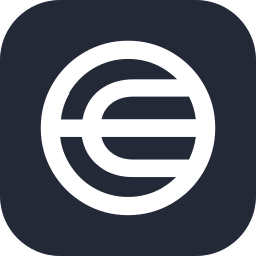 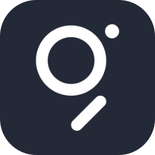 
--> 

<table>
  <tr>
    <th align="left"><h3>Layer&nbsp;&nbsp;&nbsp;&nbsp;&nbsp;&nbsp;&nbsp;&nbsp;&nbsp;&nbsp;&nbsp;&nbsp;&nbsp;&nbsp;&nbsp;&nbsp;&nbsp;&nbsp;&nbsp;&nbsp;&nbsp;&nbsp;&nbsp;&nbsp;&nbsp;&nbsp;&nbsp;&nbsp;&nbsp;&nbsp;&nbsp;&nbsp;</h3></th>
    <th align="left"><h3>Stack</h3></th>
  </tr>
  <tr>
    <td></td>
    <td> 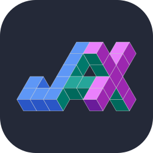 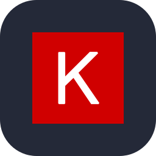 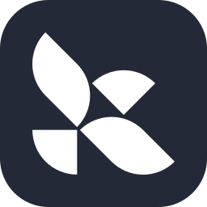 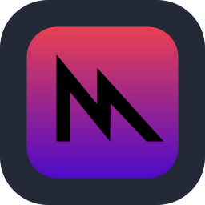     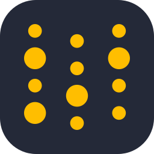</td>
  </tr>
  <tr>
    <td></td>
    <td> 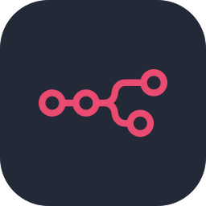  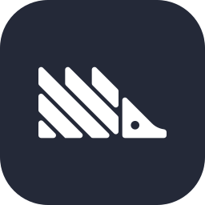  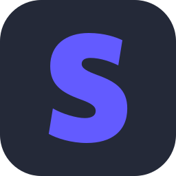 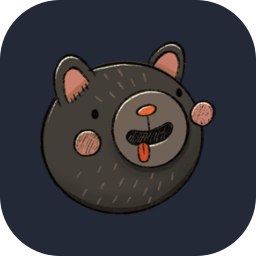</td>
  </tr>
  <tr>
    <td></td>
    <td>         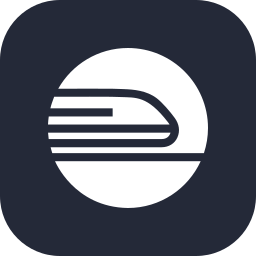 </td>
  </tr>
  <tr>
    <td></td>
    <td>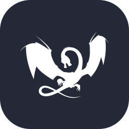 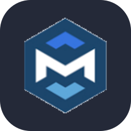 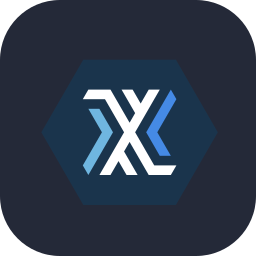</td>
  </tr>
  <tr>
    <td></td>
    <td>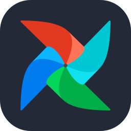 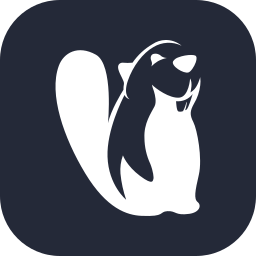 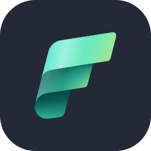   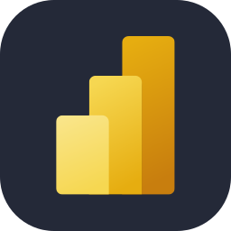  </td>
  </tr>
  <tr>
    <td></td>
    <td>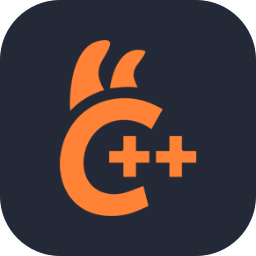 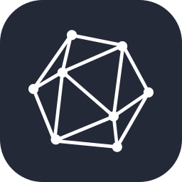 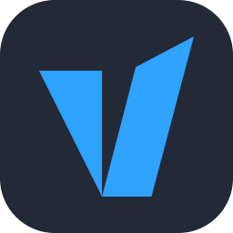</td>
  </tr>
  <tr>
    <td></td>
    <td>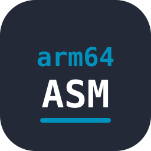     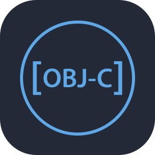    </td>
  </tr>
  <tr>
    <td></td>
    <td> 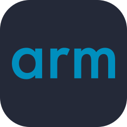 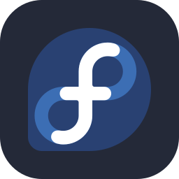   </td>
  </tr>
  <tr>
    <td></td>
    <td>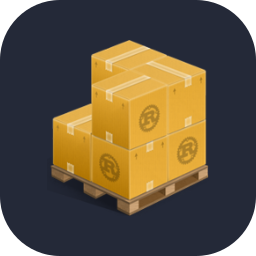       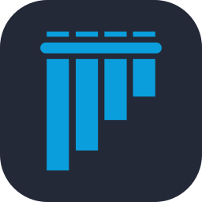 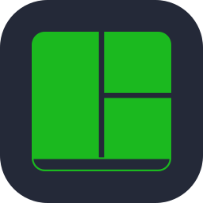 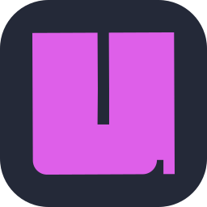</td>
  </tr>
  <tr>
    <td></td>
    <td>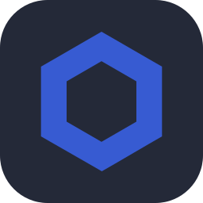 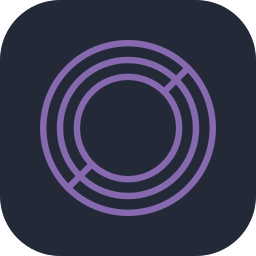 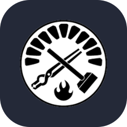 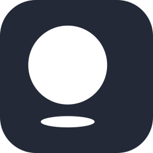 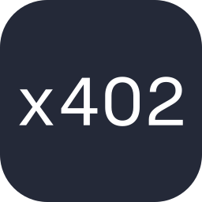</td>
  </tr>
</table>

<h2 align="left">On GitHub Lately [ :O ]</h2>

  

<!-- <table align="center">
  <tr>
    <td width="58%" align="center">
      
       
      
    </td>
    <td width="42%" align="center">
      
    </td>
  </tr>
</table> -->

  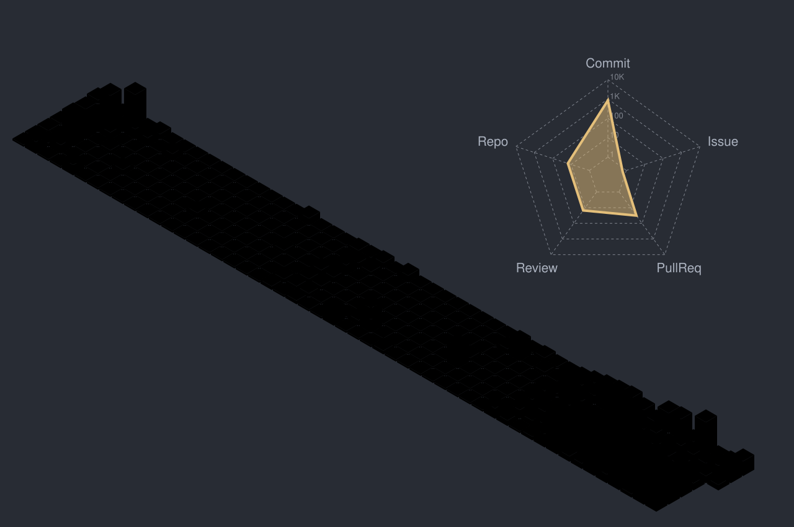

